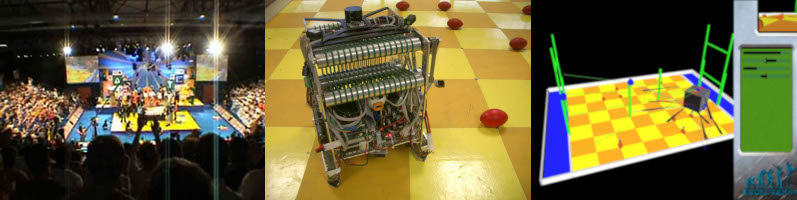
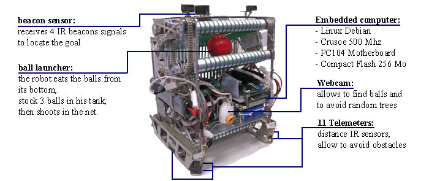
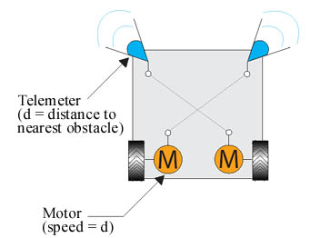
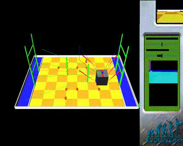
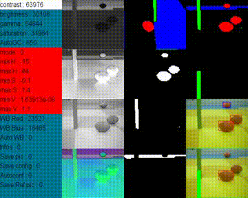
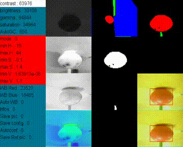

[Pierre Sermanet](https://sermanet.github.io/home/), [Philippe Rambert](https://www.linkedin.com/in/philipperambert), [Jean-Baptiste Mouret](https://members.loria.fr/JBMouret/) and the rest of the [Evolutek](http://www.evolutek.org) team 

Click [here](videos/rules.wmv) to download the video explaining the rules.

### Eurobot international robotics contest

- Since 1998, Eurobot is an international robotics contest.
- Eurobot takes place in Europe but also welcomes countries from other continents.
- 2004: **21 countries**, represented by **250 teams**.
- New rules each year.

### Rules: rugby match on a tropical island

- **2 robots**, 14 rugby balls, 2 random palm trees on the playground.
- **90 seconds matchs**.
- The winner is the robot that has put more balls in the blue area or in the net.
- The robots can carry only 3 balls simultaneously.

### The Robot: main components

### Movements: a reactive robot

This robot does not assume it is working on the Eurobot's board, and therefore can evolve in an **unknown environment**.
The **best trajectory** is calculated in **real time** according to:
- the distances given by the 11 telemeters
- the distances of the balls and trees given by the camera

### 3D Simulator: testing in good conditions

A 3D simulator has been developped in **C++ and OpenGL** in order to check the theorical robot's behaviors.
This simulator allows us to develop the robot's AI software when the real robot is not functionnal.

### Image processing: balls and trees

Thanks to the video camera, the robot is able to **locate red balls** and to subsequently head on towards the nearest red ball (blue areas are also detected in order to avoid them).
This robot can also **avoid green trees** according to their distance and direction.
The camera settings program has been developped in **C++** and allows the user to check image processing results.

### Robot behavior demonstrations

